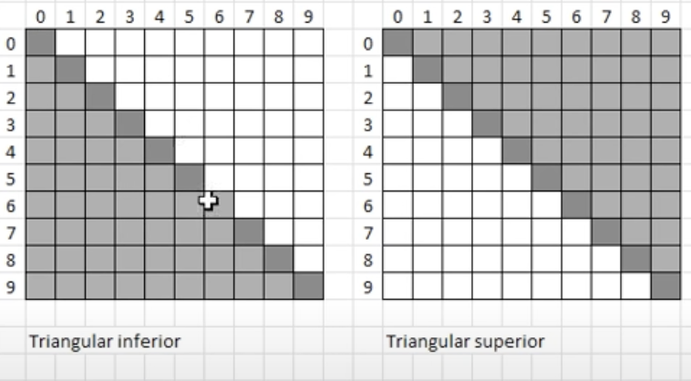

# Matrices 
## Declaracion de matrices
```cpp
int mat[n][m]
```
- `n y m` son las dimensiones 
- `n` cantidad de **FILAS**
- `m` cantidad de **COLUMNAS**

## Recorrido de matrices 
### Secuencial
- Recorrido por FILAS
```cpp
int n, m;
    for ( n=0; n<4; n++)
        for ( m=0; m<5; m++)
            mat[n][m] = 0;
```
- Recorrido por COLUMNA
```cpp
int n, m;
    for (m=0;m<5;m++)
        for (n=0;n<4;n++)
            mat[n][m]=0;
```

## Sumatoria de los elementos de la Matriz
- Por FILA
```cpp
int n, m, suma;

suma = 0;

for (n=0;n<4;n++)
    for (m=0;m<5;m++)
        suma += mat[n][m];
```
- Por COLUMNA
```cpp
int n, m, suma;

suma = 0;

for (m=0;m<5;m++)
    for (n=0;n<4;n++)
        suma += mat[n][m];
```

## Impresion matricial
```cpp
#include <iomanip> //Bibloteca para impresion matricial

for (n=0;n<5;n++){
    cout<< "Fila" << n << ":";
    for (m=0;m<5;m++){
        cout<<setw(5)<<mat[n][m]
        }
        cout<<endl;
}
```

## Diagonal principal

- Matriz cuadrada (NxM)
- Igual cantidades de FILAS y COLUMNAS
```cpp
int mat[10][10];
```
Para asignar un valor igual a todos los elemetos de la diagonal principal:
```cpp
int w

for(w=0;w<10;w++)
    mat[w][w]=99;
```

## Triangular sup e inf

- Superior 
```cpp
// Triangular superior
    for (i = 0; i < n; i++) {
        for (j = i + 1; j < m; j++) {
            mat[i][j] = 88;
        }
    }
```
- Inferior 
```cpp
// Triangular inferior
    for (i = 0; i < n; i++) {
        for (j = 0; j < i; j++) {
            mat[i][j] = 77;
        }
    }
``` 

## Diagonal secundaria 

```cpp
for (i=0;i<n;i++){
    mat[i][n-1-i]=66;
}
```
